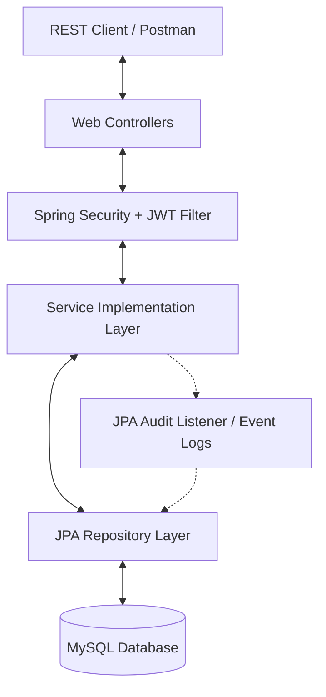
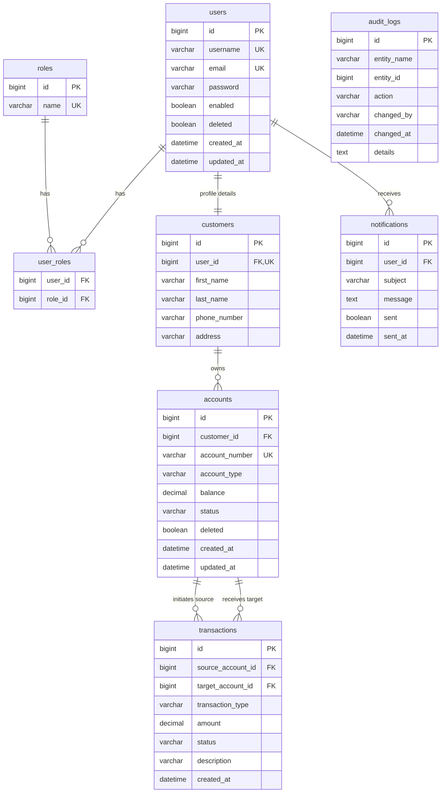

# Digital Banking & Wallet System API

An enterprise-grade **Digital Banking and Wallet API** built using **Spring Boot 3**, **Spring Security**, **JPA (Hibernate)**, and **MySQL**. This system provides a robust banking ledger supporting customer registrations, checkings/savings/business accounts, logical soft deletions, JPA entity auditing, transactional transfers, and dynamic transaction filtering.

## 🚀 Key Features

1. **Role-Based REST APIs**: Complete set of endpoints (GET, POST, PUT, PATCH, DELETE) secured via JWT, exposing role-based access for `CUSTOMER`, `EMPLOYEE`, and `ADMIN`.
2. **Account Management & Status**: Open accounts, suspend them, or close them. Restricts transactions on non-active accounts.
3. **Double-Entry Financial Transactions**: Robust deposit, withdrawal, and transfer services running under Spring `@Transactional` database isolation.
4. **Dynamic Transaction Filters**: Multi-criteria search (by type, status, min/max amount, date range, or account) utilizing JPA Criteria API (Specifications) with pagination and sorting.
5. **Soft Delete**: Uses Hibernate `@SQLDelete` and `@SQLRestriction("deleted = false")` on Users and Accounts to safeguard data.
6. **Automatic Auditing**: Custom JPA entity listeners track changes to Users, Accounts, and Transactions, logging who made which change, when, and what changed into an `audit_logs` table.
7. **Simulation Services**: Simulates notification dispatches (e.g. email receipt) to customers on successful ledger transactions.
8. **Dockerized Environment**: Built-in `Dockerfile` and `docker-compose.yml` orchestrating Spring Boot and a MySQL 8.0 instance.

---

## 🛠️ Technology Stack
* **Java 17 / 21+**
* **Spring Boot 3.3.2**
* **Spring Security 6** (Stateless, JWT Auth)
* **Spring Data JPA** (Hibernate 6)
* **MySQL 8** Database
* **Lombok**
* **JJWT (Java JWT) 0.12.5**
* **Docker & Docker Compose**

---

## 📁 Package Layout
```text
com.banking.system
├── BankingSystemApplication.java (Entry Point)
├── config/                        (Spring configurations, Security, JPA Auditing, Beans)
├── domain/                        (JPA Entity models: User, Role, Customer, Account, Transaction, AuditLog, Notification)
├── listener/                      (JPA AuditListener intercepting entity lifecycles)
├── repository/                    (Data access interfaces, JpaRepository, JPA Specifications)
├── service/                       (Business logic interfaces & implementations)
└── web/
    ├── controller/                (REST API Controllers securing endpoints)
    ├── dto/                       (Request/Response validation schemas)
    └── exception/                 (Global REST exceptions & RFC-7807 handler)
```

---

## 🏗️ Architecture Diagram



---

## 📊 Entity Relationship Diagram



---

## 🚦 REST API Catalog

| Group | Method | Endpoint | Description | Permitted Roles |
| :--- | :--- | :--- | :--- | :--- |
| **Auth** | `POST` | `/api/auth/register` | Register a new customer user and profile | `Public` |
| | `POST` | `/api/auth/login` | Login and obtain JWT Bearer Token | `Public` |
| **Users** | `GET` | `/api/users/{username}` | Get user details | `OWNER`, `EMPLOYEE`, `ADMIN` |
| | `GET` | `/api/users` | List all system users | `EMPLOYEE`, `ADMIN` |
| | `DELETE`| `/api/users/{id}` | Soft delete a user profile | `ADMIN` |
| **Accounts**| `POST` | `/api/accounts` | Create checking/savings/business account | `EMPLOYEE`, `ADMIN` |
| | `GET` | `/api/accounts/{accountNumber}` | Get detailed account ledger details | `OWNER`, `EMPLOYEE`, `ADMIN` |
| | `GET` | `/api/accounts/customer/{customerId}` | List accounts belonging to a customer | `OWNER`, `EMPLOYEE`, `ADMIN` |
| | `PATCH`| `/api/accounts/{accountNumber}/status` | Update account status (ACTIVE, SUSPENDED, CLOSED) | `EMPLOYEE`, `ADMIN` |
| | `DELETE`| `/api/accounts/{accountNumber}` | Soft delete a bank account | `ADMIN` |
| **Transactions**| `POST` | `/api/transactions/deposit` | Deposit funds into an account | `CUSTOMER`, `EMPLOYEE`, `ADMIN` |
| | `POST` | `/api/transactions/withdraw` | Withdraw funds from an account | `CUSTOMER`, `EMPLOYEE`, `ADMIN` |
| | `POST` | `/api/transactions/transfer` | Transfer money between accounts | `CUSTOMER`, `EMPLOYEE`, `ADMIN` |
| | `GET` | `/api/transactions/search` | Dynamic transaction filter, sorting, pageable | `CUSTOMER` (Own), `EMPLOYEE`, `ADMIN` |
| **Auditing**| `GET` | `/api/audit-logs` | Get all system audit events | `ADMIN` |
| | `GET` | `/api/audit-logs/entity/{entityName}` | Filter audit logs by entity type | `ADMIN` |

---

## 🛠️ Setup and Running Guide

### Running with Docker Compose (Recommended)
1. Ensure Docker is running.
2. Open terminal in root project directory.
3. Run:
   ```bash
   docker-compose up --build
   ```
This compiles the java binary, constructs the container, spins up the MySQL database, seeds the system roles, and runs the application. The API will be available at `http://localhost:8080`.

### Running Locally
1. Ensure MySQL is running on port 3306 with a database named `banking_db`. Configure your local credentials in `src/main/resources/application.yml` or supply them as env variables.
2. Build project using Maven:
   ```bash
   mvn clean install
   ```
3. Run the Spring Boot application:
   ```bash
   mvn spring-boot:run
   ```
